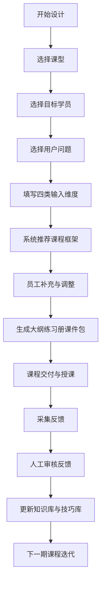

# PRD-课研魔方课程设计与质量分析平台

## 1. 文档信息

### 1.1 基本信息
- 文档名称：课研魔方课程设计与质量分析平台 PRD
- 版本：v1.0
- 状态：评审稿（可进入需求评审与排期）
- 读者：产品、运营、培训负责人、研发、测试、项目管理、管理层
- 输入来源：`docs/系统沟通记录.md`（第一轮至第二十五轮）
- 文档日期：2026-06-01

### 1.2 变更记录
| 版本 | 日期 | 作者 | 变更说明 |
|---|---|---|---|
| v1.0 | 2026-06-01 | PO/PM | 首版建立，覆盖 MVP 与全能力规划 |

### 1.3 本文档范围
- 写什么：
  - 课程设计与质量分析平台的业务目标、角色边界、功能需求、分期优先级、验收标准。
  - MVP 与全能力（P2/P3）并列规划。
- 不写什么：
  - 数据库、接口、字段、页面路由、技术架构、微服务拆分、代码常量、实现细节。

---

## 2. 产品概述

### 2.1 背景
当前课程设计能力高度依赖负责人隐性经验，员工“知道要执行但不知道为何如此设计”。资料分散于案例文件，检索困难，课程质量反馈零散，难以形成持续迭代闭环。

### 2.2 定位
将“负责人隐性课程设计经验”翻译成“员工可执行规则”的课程设计与质量分析平台，支持内部员工与合作 OPC 讲师高效产出课程方案，并通过反馈数据持续优化内容。

### 2.3 价值主张
- 对内部团队：30 分钟内形成可用课程设计初稿，降低对单人经验依赖。
- 对 OPC 讲师：可独立设计课程并沉淀质量分析资产，用于迭代和对外展示。
- 对管理层：以数据看板追踪课程质量变化与迭代方向。

### 2.4 产品原则
- 先可执行，再智能化：先让员工跑通，再持续优化推荐能力。
- 以用户问题为轴：内容组织与推荐优先围绕用户问题，不盲目追工具热度。
- 来源透明：知识库沉淀与系统生成内容必须标注来源。
- 人工可纠偏：核心反馈更新需人工审核，避免误导性自动更新。

### 2.5 产品边界（做 / 不做 / 后续）
- 做：
  - 课程设计、知识库支撑、反馈分析、积分扣费（按次）、角色隔离与管理视图。
- 不做（本 PRD 范围外）：
  - 学员管理系统、完整课程排课交付系统、企业找讲师撮合交易、在线支付购买流程。
- 后续规划：
  - 更高精度推荐与自动化内容补全、讲师成长辅助能力、跨组织趋势洞察能力。

---

## 3. 术语表

| 术语 | 定义 |
|---|---|
| 课型 | 课程类型：半天公开课、一天技能课、多天实训营、企业内训 |
| 功能模块 | 知识库最小教学单元，如“多维表格”“视频制作” |
| 案例素材 | 支撑功能模块讲解的业务案例、练习样例、应用场景 |
| 培训师技巧 | 授课中的节奏、理论实操占比、互动方式、注意事项 |
| 课程大纲 | 课程结构说明，含模块拆解、每段目标与工具 |
| 练习册 | 实操课程配套操作手册，含提示词、步骤、作业 |
| 课件包 | 授课素材包，供培训师二次组装 PPT |
| 反馈闭环 | 课后反馈采集、人工审核、知识更新、下期迭代的循环 |
| OPC | 合作讲师群体（艺人公司讲师） |
| 积分 | OPC 在平台使用课程设计/分析能力的按次计费单位 |

---

## 4. 用户与角色

### 4.1 用户画像
- 内部员工：课程设计执行者，需要规则化指引、案例支撑与快速产出。
- 培训负责人/管理层：关注课程效果、迭代方向与团队执行质量。
- OPC 讲师：独立设计企业内训为主课程，关注个人课程质量沉淀与展示。
- 平台管理员（业务方）：查看内外两端课程全貌，进行运营与策略管理。

### 4.2 角色权限矩阵（产品层）
| 能力 | 内部员工 | OPC 讲师 | 培训负责人/管理层 | 平台管理员 |
|---|---|---|---|---|
| 创建课程设计 | 是 | 是 | 否 | 否 |
| 查看自身课程数据 | 是 | 是 | 否 | 否 |
| 查看团队/组织汇总数据 | 否 | 否 | 是（内部） | 是（全局） |
| 查看他人课程内容 | 否 | 否 | 否 | 是（全量查看） |
| 课程质量分析报告生成 | 是 | 是（扣积分） | 否 | 否 |
| 对企业分享分析页 | 否 | 是（主动分享） | 否 | 否 |
| 决策纠偏（线下） | 否 | 否 | 是 | 是 |

说明：内部员工与 OPC 讲师数据完全隔离；平台管理员可查看完整内容但不在系统内干预课程设计结果。

---

## 5. 产品架构

### 5.1 功能模块清单
- 课程设计中心
  - 课型选择
  - 目标学员选择
  - 用户问题选择
  - 设计输入采集（市场、用户洞察、产品植入、授课技巧）
  - 课程框架推荐与人工调整
  - 成果输出（大纲、练习册、课件包）
- 知识库中心
  - 功能模块库（含时间戳）
  - 案例素材库
  - 培训师技巧库
  - 来源标注与缺口提示
- 反馈分析中心
  - 问卷/口头反馈沉淀
  - 课程整体评分与模块反馈
  - 课程迭代建议
  - 数据看板（内部管理视图）
- OPC 运营中心
  - 积分余额与扣费记录
  - 课程设计按次扣费
  - 分析报告按次扣费
  - 充值后续用提示
- 分享与展示
  - OPC 分析页分享（仅主动分享可见）
  - 企业查看课程质量摘要（仅被分享后）

### 5.2 核心业务流程（Mermaid）

---

## 6. 用户旅程

### 6.1 主旅程：内部员工课程设计与迭代
| 阶段 | 用户行为 | 触点功能 | 完成标志 |
|---|---|---|---|
| 需求识别 | 选择课型/学员/问题 | 课程设计入口 | 建立课程设计上下文 |
| 信息输入 | 补充市场、洞察、产品、技巧信息 | 输入维度表单 | 输入完整且可提交 |
| 方案产出 | 接收推荐并手动调整 | 推荐框架与编辑区 | 形成可交付初稿 |
| 交付执行 | 用大纲+练习册+课件包授课 | 成果下载/查看 | 完成授课执行 |
| 反馈沉淀 | 回收问卷与补充反馈 | 反馈采集页 | 反馈入库可分析 |
| 内容优化 | 查看建议并改版课程 | 分析看板与迭代建议 | 新版本课程发布 |

### 6.2 关键角色旅程：OPC 讲师课程设计与对外展示
| 阶段 | 用户行为 | 触点功能 | 完成标志 |
|---|---|---|---|
| 准备阶段 | 查看积分并发起设计 | 积分与设计入口 | 扣费成功并进入设计 |
| 课程产出 | 完成课程设计内容 | 课程设计中心 | 生成可用课程内容 |
| 课后分析 | 发起分析报告生成 | 质量分析功能 | 报告归档至本人名下 |
| 结果展示 | 主动分享分析页给企业 | 分享链接功能 | 企业可查看分享页 |
| 持续优化 | 基于历史反馈迭代课程 | 个人课程分析页 | 下一版课程改进完成 |

### 6.3 旅程流程图（Mermaid）

---

## 7. MVP 功能需求

> 说明：以下用户故事统一采用指定句式，并附可验收 DOD。MVP 聚焦“先跑起来”，不覆盖交易撮合与复杂自动决策。

### 7.1 模块A：课程设计主流程

#### 功能说明
- 做什么：按“课型 -> 学员 -> 问题”组织设计起点，支持 30 分钟形成初稿。
- 边界：提供推荐与辅助，不替代负责人最终战略决策。
- 扣点/计费规则：内部员工不扣点；OPC 在“点击开始设计”时按次扣点。

**US-A1**
> 我作为一个 **内部员工**，通过使用 **课型优先选择入口**，以达到 **快速确定课程设计起点** 的目的。
- [ ] **前提**：我已进入课程设计中心并具备创建权限。
- [ ] **操作**：我先选择课型再进入下一步。
- [ ] **结果**：系统按课型加载对应设计模板和提示。

**US-A2**
> 我作为一个 **内部员工**，通过使用 **目标学员选择功能**，以达到 **让课程内容贴合受众画像** 的目的。
- [ ] **前提**：已选定课型。
- [ ] **操作**：我选择目标学员类型。
- [ ] **结果**：系统展示针对该学员的设计提示与注意项。

**US-A3**
> 我作为一个 **内部员工**，通过使用 **用户问题选择功能**，以达到 **围绕真实需求组织课程内容** 的目的。
- [ ] **前提**：已选课型与学员。
- [ ] **操作**：我选择本次课程要解决的核心问题。
- [ ] **结果**：系统推荐内容方向与模块优先级。

**US-A4**
> 我作为一个 **内部员工**，通过使用 **输入维度填写功能**，以达到 **补全课程设计关键上下文** 的目的。
- [ ] **前提**：已完成基础三步选择。
- [ ] **操作**：我填写市场竞品、用户洞察、产品植入、授课技巧。
- [ ] **结果**：系统允许提交并进入推荐生成。

**US-A5**
> 我作为一个 **内部员工**，通过使用 **系统推荐课程框架**，以达到 **减少从零搭建课程结构时间** 的目的。
- [ ] **前提**：输入维度已提交。
- [ ] **操作**：我触发课程框架推荐。
- [ ] **结果**：系统输出可编辑的课程结构草案。

**US-A6**
> 我作为一个 **内部员工**，通过使用 **课程框架编辑功能**，以达到 **结合现场经验调整课程方案** 的目的。
- [ ] **前提**：已有系统草案。
- [ ] **操作**：我增删模块、调整顺序和内容重点。
- [ ] **结果**：系统保存调整后的最终方案。

**US-A7**
> 我作为一个 **内部员工**，通过使用 **课程成果打包功能**，以达到 **一次性获得可交付内容** 的目的。
- [ ] **前提**：课程方案完成编辑。
- [ ] **操作**：我发起成果生成。
- [ ] **结果**：系统输出课程大纲、练习册和课件包素材。

**US-A8**
> 我作为一个 **内部员工**，通过使用 **30分钟效率提醒机制**，以达到 **控制单次设计耗时** 的目的。
- [ ] **前提**：我已开始课程设计。
- [ ] **操作**：我在设计过程中查看阶段进度提示。
- [ ] **结果**：系统明确当前完成度与剩余关键步骤。

### 7.2 模块B：知识库结构化与检索

#### 功能说明
- 做什么：沉淀功能模块、案例素材、培训师技巧三类内容，并支持课程设计调用。
- 边界：知识库只定义业务内容结构，不定义技术标签体系实现方式。
- 扣点/计费规则：MVP 不单独计费，作为设计功能能力包的一部分。

**US-B1**
> 我作为一个 **课程设计人员**，通过使用 **功能模块库**，以达到 **快速复用可讲授模块** 的目的。
- [ ] **前提**：知识库中已有模块沉淀。
- [ ] **操作**：我按主题查找功能模块。
- [ ] **结果**：系统返回可直接纳入课程的模块条目。

**US-B2**
> 我作为一个 **课程设计人员**，通过使用 **案例素材库**，以达到 **为模块匹配实战案例** 的目的。
- [ ] **前提**：已选定一个或多个功能模块。
- [ ] **操作**：我筛选对应案例素材。
- [ ] **结果**：系统展示与模块关联度高的案例列表。

**US-B3**
> 我作为一个 **课程设计人员**，通过使用 **培训师技巧库**，以达到 **提升课程讲授可理解度** 的目的。
- [ ] **前提**：课程模块已初步确定。
- [ ] **操作**：我查看该模块推荐授课技巧。
- [ ] **结果**：系统提供节奏、互动、理论实操占比建议。

**US-B4**
> 我作为一个 **课程设计人员**，通过使用 **内容时间戳标识**，以达到 **优先采用最新有效内容** 的目的。
- [ ] **前提**：同主题存在多个版本内容。
- [ ] **操作**：我查看版本时间和更新状态。
- [ ] **结果**：系统可识别并优先提示较新版本。

**US-B5**
> 我作为一个 **课程设计人员**，通过使用 **来源标注能力**，以达到 **区分知识沉淀与系统生成内容** 的目的。
- [ ] **前提**：系统给出课程建议内容。
- [ ] **操作**：我查看每条建议的来源标识。
- [ ] **结果**：我能判断内容可信度并决定是否修改。

**US-B6**
> 我作为一个 **课程设计人员**，通过使用 **知识缺口提示**，以达到 **识别当前课程所缺关键素材** 的目的。
- [ ] **前提**：我已生成课程草案。
- [ ] **操作**：我查看缺口提示列表。
- [ ] **结果**：系统明确指出需人工补充的模块或案例。

**US-B7**
> 我作为一个 **课程设计人员**，通过使用 **新增知识回填入口**，以达到 **反向完善知识库资产** 的目的。
- [ ] **前提**：我在设计中发现知识库缺项。
- [ ] **操作**：我提交新增内容或补充说明。
- [ ] **结果**：系统记录待审核知识条目。

**US-B8**
> 我作为一个 **培训负责人**，通过使用 **知识更新审核入口**，以达到 **确保知识更新质量可控** 的目的。
- [ ] **前提**：系统存在待审核知识更新项。
- [ ] **操作**：我对条目进行通过或驳回处理。
- [ ] **结果**：仅审核通过内容进入正式知识库。

### 7.3 模块C：课程输出物（大纲/练习册/课件包）

#### 功能说明
- 做什么：课程设计完成后输出三类可交付成果。
- 边界：输出“可授课基础材料”，不直接替代最终 PPT 二次制作。
- 扣点/计费规则：计入课程设计按次能力，不额外拆分。

**US-C1**
> 我作为一个 **培训师**，通过使用 **课程大纲输出功能**，以达到 **清晰说明每阶段课程内容** 的目的。
- [ ] **前提**：课程结构已确认。
- [ ] **操作**：我生成课程大纲。
- [ ] **结果**：输出按日/按模块组织的结构化课程说明。

**US-C2**
> 我作为一个 **培训师**，通过使用 **练习册输出功能**，以达到 **支撑学员实操演练** 的目的。
- [ ] **前提**：课程包含实操环节。
- [ ] **操作**：我生成练习册。
- [ ] **结果**：输出包含提示词、步骤说明、作业要求的练习内容。

**US-C3**
> 我作为一个 **培训师**，通过使用 **课件包素材输出功能**，以达到 **降低备课组装成本** 的目的。
- [ ] **前提**：课程内容已成稿。
- [ ] **操作**：我导出课件包素材。
- [ ] **结果**：输出可供后续 PPT 组装的素材集合。

**US-C4**
> 我作为一个 **培训师**，通过使用 **输出物来源追溯信息**，以达到 **判断各内容的可信度与可用性** 的目的。
- [ ] **前提**：输出物已生成。
- [ ] **操作**：我查看每部分内容来源。
- [ ] **结果**：系统可区分知识库沉淀与自动生成来源。

**US-C5**
> 我作为一个 **培训师**，通过使用 **缺失项提醒**，以达到 **避免空壳输出直接授课** 的目的。
- [ ] **前提**：部分模块缺少知识库支撑。
- [ ] **操作**：我查看输出前风险提醒。
- [ ] **结果**：系统明确要求补充后再用于正式交付。

**US-C6**
> 我作为一个 **内部员工**，通过使用 **课程包迭代复用功能**，以达到 **基于旧课快速改版** 的目的。
- [ ] **前提**：已有历史课程输出物。
- [ ] **操作**：我基于历史版本发起新版本设计。
- [ ] **结果**：系统继承可复用内容并标注调整点。

### 7.4 模块D：反馈采集与质量分析

#### 功能说明
- 做什么：统一采集课后反馈，形成课程整体评分与模块级反馈，并给出迭代建议。
- 边界：本系统侧重内容优化，不承担完整学员生命周期管理。
- 扣点/计费规则：内部员工使用不扣点；OPC 报告生成为按次扣点。

**US-D1**
> 我作为一个 **培训师**，通过使用 **课后问卷回收功能**，以达到 **获得结构化学员反馈** 的目的。
- [ ] **前提**：课程已结束。
- [ ] **操作**：我发起并回收课后问卷。
- [ ] **结果**：系统沉淀可分析的反馈数据。

**US-D2**
> 我作为一个 **培训师**，通过使用 **口头反馈补录功能**，以达到 **补全非问卷反馈信息** 的目的。
- [ ] **前提**：课堂存在口头反馈或访谈记录。
- [ ] **操作**：我补录关键反馈内容。
- [ ] **结果**：反馈库中可统一查看结构化与非结构化反馈。

**US-D3**
> 我作为一个 **培训负责人**，通过使用 **反馈人工审核流程**，以达到 **过滤失真反馈后再更新知识库** 的目的。
- [ ] **前提**：系统已有待审核反馈。
- [ ] **操作**：我执行审核处理。
- [ ] **结果**：仅有效反馈进入迭代依据。

**US-D4**
> 我作为一个 **培训负责人**，通过使用 **课程整体评分**，以达到 **快速判断课程效果趋势** 的目的。
- [ ] **前提**：课程反馈量达到最低分析门槛（待运营配置）。
- [ ] **操作**：我查看课程整体评分。
- [ ] **结果**：可看到课程效果变化趋势。

**US-D5**
> 我作为一个 **培训负责人**，通过使用 **模块级反馈分析**，以达到 **定位课程薄弱环节** 的目的。
- [ ] **前提**：课程按模块采集了反馈。
- [ ] **操作**：我查看模块反馈明细。
- [ ] **结果**：系统指出问题模块与优化方向。

**US-D6**
> 我作为一个 **内部员工**，通过使用 **迭代建议生成**，以达到 **明确下期课程优化动作** 的目的。
- [ ] **前提**：课程反馈已完成分析。
- [ ] **操作**：我查看系统给出的内容优化建议。
- [ ] **结果**：我能据此修改课程方案并发布新版。

**US-D7**
> 我作为一个 **管理层用户**，通过使用 **课程质量数据看板**，以达到 **查看课程优化成效** 的目的。
- [ ] **前提**：系统累计多期课程反馈数据。
- [ ] **操作**：我查看看板中的关键指标趋势。
- [ ] **结果**：可识别优化是否带来效果提升。

**US-D8**
> 我作为一个 **管理层用户**，通过使用 **课程停开/续开辅助提示**，以达到 **支持线下决策讨论** 的目的。
- [ ] **前提**：课程有连续周期反馈记录。
- [ ] **操作**：我查看系统辅助提示信息。
- [ ] **结果**：系统提供可讨论的判断依据，但不自动替代拍板。

### 7.5 模块E：OPC 讲师端与积分计费

#### 功能说明
- 做什么：为 OPC 提供独立课程设计与质量分析能力，支持按次扣费。
- 边界：不做在线购买闭环，仅支持充值后使用与余额提示。
- 扣点/计费规则：
  - 点击开始课程设计即扣费。
  - 生成分析报告按次扣费。
  - 报告重复查看不重复扣费。
  - 余额不足需充值后继续。
  - 单价：待运营/待确认配置。

**US-E1**
> 我作为一个 **OPC讲师**，通过使用 **积分余额查看功能**，以达到 **确认可用次数后再发起设计** 的目的。
- [ ] **前提**：我已登录 OPC 讲师端。
- [ ] **操作**：我查看当前积分余额。
- [ ] **结果**：系统展示可用余额与最近扣费记录。

**US-E2**
> 我作为一个 **OPC讲师**，通过使用 **开始设计即扣费机制**，以达到 **按次计费透明可预期** 的目的。
- [ ] **前提**：我的积分余额充足。
- [ ] **操作**：我点击开始课程设计。
- [ ] **结果**：系统立即扣费并记录本次使用。

**US-E3**
> 我作为一个 **OPC讲师**，通过使用 **中途放弃仍计费规则提示**，以达到 **在开始前充分确认需求** 的目的。
- [ ] **前提**：我准备发起设计。
- [ ] **操作**：我查看计费规则说明并确认。
- [ ] **结果**：系统明确中途放弃不退还本次扣费。

**US-E4**
> 我作为一个 **OPC讲师**，通过使用 **分析报告按次扣费功能**，以达到 **按价值使用质量分析能力** 的目的。
- [ ] **前提**：课程已有可分析反馈数据。
- [ ] **操作**：我发起分析报告生成。
- [ ] **结果**：系统按次扣费并生成报告归档。

**US-E5**
> 我作为一个 **OPC讲师**，通过使用 **报告多次查看不重复扣费机制**，以达到 **反复复盘课程质量** 的目的。
- [ ] **前提**：我已生成某次分析报告。
- [ ] **操作**：我重复查看历史报告。
- [ ] **结果**：系统不重复扣费。

**US-E6**
> 我作为一个 **OPC讲师**，通过使用 **余额不足提示**，以达到 **及时充值后继续使用** 的目的。
- [ ] **前提**：我的积分不足以发起下一次操作。
- [ ] **操作**：我尝试开始设计或生成报告。
- [ ] **结果**：系统阻止继续并提示充值后再用。

**US-E7**
> 我作为一个 **OPC讲师**，通过使用 **个人数据隔离机制**，以达到 **仅查看自己的课程与反馈** 的目的。
- [ ] **前提**：平台存在多个 OPC 讲师。
- [ ] **操作**：我访问课程与分析页面。
- [ ] **结果**：系统仅展示我本人相关数据。

**US-E8**
> 我作为一个 **平台管理员**，通过使用 **OPC内容全量查看能力**，以达到 **统一掌握外部讲师课程情况** 的目的。
- [ ] **前提**：管理员拥有管理后台权限。
- [ ] **操作**：我查看 OPC 课程完整内容。
- [ ] **结果**：系统允许全量查看且不改变讲师课程归属。

### 7.6 模块F：分享展示与权限隔离

#### 功能说明
- 做什么：支持 OPC 主动分享课程质量页面给企业；实现内外端彻底隔离。
- 边界：分享是展示，不承载企业下单或交易流程。
- 扣点/计费规则：分享动作本身不计费。

**US-F1**
> 我作为一个 **OPC讲师**，通过使用 **分析页主动分享功能**，以达到 **向企业展示课程能力** 的目的。
- [ ] **前提**：我已生成分析报告。
- [ ] **操作**：我主动创建并发送分享入口给企业。
- [ ] **结果**：企业可通过分享入口查看展示页。

**US-F2**
> 我作为一个 **企业客户**，通过使用 **分享页查看能力**，以达到 **快速了解讲师课程质量** 的目的。
- [ ] **前提**：我收到 OPC 主动分享入口。
- [ ] **操作**：我打开分享页查看内容。
- [ ] **结果**：我能看到整体评分与模块反馈摘要。

**US-F3**
> 我作为一个 **企业客户**，通过使用 **受控可见机制**，以达到 **仅在被授权时查看课程分析** 的目的。
- [ ] **前提**：我未收到分享入口。
- [ ] **操作**：我尝试直接访问展示内容。
- [ ] **结果**：系统不展示未授权分析页面。

**US-F4**
> 我作为一个 **内部员工**，通过使用 **内外数据隔离机制**，以达到 **避免看到 OPC 讲师课程内容** 的目的。
- [ ] **前提**：系统同时存在内部与 OPC 数据。
- [ ] **操作**：我在内部端浏览课程资产。
- [ ] **结果**：系统不返回任何 OPC 课程内容。

**US-F5**
> 我作为一个 **OPC讲师**，通过使用 **内外数据隔离机制**，以达到 **避免看到内部员工课程内容** 的目的。
- [ ] **前提**：系统同时存在内部与 OPC 数据。
- [ ] **操作**：我在 OPC 端浏览课程资产。
- [ ] **结果**：系统不返回任何内部课程内容。

**US-F6**
> 我作为一个 **平台管理员**，通过使用 **双侧全景查看能力**，以达到 **在管理后台统一掌握课程资产全貌** 的目的。
- [ ] **前提**：我是管理后台授权用户。
- [ ] **操作**：我查看内部与 OPC 两侧课程概览。
- [ ] **结果**：系统展示双侧数据且保持前台隔离。

---

## 8. 全能力规划（P2/P3）

> 说明：以下能力为投标/远期能力方向，不等于 v1 必做。

### 8.1 P2（中期）
- 讲师成长辅导：基于历史表现生成“能力提升问答卡”和复盘模板。
- 新讲师冷启动增强：提供更细颗粒市场趋势参考和起步案例包。
- 课程模板行业化：按部门/行业场景沉淀模板（如电商、内容、HR）。
- 课程版本对比：支持同一课程多版本差异对照分析。
- 管理层策略视图：增加不同课型的内容优化收益对比。

### 8.2 P3（远期）
- 更强自动化建议：对模块替换、案例替换、授课技巧组合给出更高质量建议。
- 组织级知识协同：支持更多协作方在合规边界内共享可复用模块。
- 课程竞争力洞察：在合规范围内增强市场趋势映射能力。
- 课程资产商业化支持：面向外部服务产品线的能力包扩展（不含交易系统）。

---

## 9. 开发优先级总表

### 9.1 MVP vs 全能力对照
| 能力项 | MVP | P2 | P3 |
|---|---|---|---|
| 课型->学员->问题主流程 | 是 | - | - |
| 四维输入与推荐框架 | 是 | 增强 | 智能化 |
| 大纲/练习册/课件包输出 | 是 | 增强模板 | 自动化深化 |
| 知识库三库结构 | 是 | 深化标签 | 协同共享 |
| 来源标注与缺口提示 | 是 | - | - |
| 反馈采集与人工审核 | 是 | 增强效率 | 智能筛选 |
| 质量看板与迭代建议 | 是 | 增强对比 | 策略预测 |
| OPC 按次积分计费 | 是 | 增强运营规则 | 商业扩展 |
| OPC 分享页展示 | 是 | 增强呈现 | 资产化扩展 |

### 9.2 Phase 里程碑
| Phase | 目标 | 里程碑产出 |
|---|---|---|
| Phase1 | 跑通课程设计闭环 | 课型主流程、三类输出、基础反馈采集 |
| Phase2 | 建立内容可迭代机制 | 知识库更新、来源标注、缺口回填、看板上线 |
| Phase3 | 支持 OPC 商业化使用 | 积分计费、报告计费、分享页、权限隔离完善 |

---

## 10. 积分与计费 / 商业模式

### 10.1 商业模式定位
- 平台定位为课程设计与质量分析工具，不是企业与讲师撮合交易平台。
- OPC 使用核心能力采用按次积分扣费，企业合作对接在线下完成。

### 10.2 积分规则（当前确认）
- 课程设计：点击开始即扣费。
- 设计中止：不退本次费用。
- 分析报告：每次生成扣费。
- 报告查看：重复查看不重复扣费。
- 余额不足：阻断操作并提示充值。
- 充值路径：由外部产品线完成，平台内承接余额可用性。

### 10.3 待确认配置
- 单次课程设计扣费额度：待运营/待确认配置。
- 单次分析报告扣费额度：待运营/待确认配置。
- 最低可分析反馈量阈值：待运营/待确认配置。

---

## 11. 非功能需求

### 11.1 安全与隐私
- 内部与 OPC 数据必须逻辑隔离，默认不可互见。
- 分享页仅可被主动分享对象访问，未分享不可见。
- 管理后台查看操作需具备可追踪记录能力（产品验收关注“可追踪”，不定义技术方案）。

### 11.2 性能与体验
- 单次课程设计流程应支持 30 分钟内完成可交付初稿（业务目标）。
- 推荐结果与输出生成应在用户可接受等待范围内完成（具体阈值待产品-研发联合评审确认）。

### 11.3 合规与内容治理
- 对外部培训资料使用需遵循“合作沟通确认后可重组使用”的业务边界。
- 课程建议内容需明确来源标注，便于责任追溯与内容校对。
- 反馈更新进入知识库前必须人工审核。

---

## 12. 验收标准与 DOD

### 12.1 迭代级 DOD
- [ ] MVP 主流程可闭环：设计、输出、反馈、迭代可跑通。
- [ ] 角色权限边界满足“内外隔离、管理可见”。
- [ ] OPC 计费规则与报告计费规则生效且可回溯。
- [ ] 核心看板可展示课程质量变化趋势。

### 12.2 里程碑级 DOD
- Phase1 DOD
  - [ ] 完成课型->学员->问题主路径。
  - [ ] 可生成大纲、练习册、课件包三类成果。
  - [ ] 完成基础反馈回收入口。
- Phase2 DOD
  - [ ] 三类知识库上线并可检索调用。
  - [ ] 来源标注、缺口提示、知识回填与审核生效。
  - [ ] 管理层可查看迭代看板。
- Phase3 DOD
  - [ ] OPC 设计/报告按次扣费规则可用。
  - [ ] 分享页仅主动分享可见。
  - [ ] 内外角色隔离通过业务验收。

### 12.3 模块 DOD 摘要
- 课程设计模块：30 分钟可形成可用初稿，支持人工调整并输出三类成果。
- 知识库模块：支持三库结构、版本时间标识、来源可追溯、缺口可回填。
- 反馈分析模块：反馈可采集、可审核、可分析，能给出可执行优化方向。
- OPC 模块：按次计费清晰，余额不足可提示，历史报告可复用查看。
- 分享权限模块：分享可控、默认不公开、企业仅见被分享内容。

---

## 13. 风险与依赖

| 风险 | 影响 | 缓解措施 |
|---|---|---|
| 知识库初期内容不足 | 输出质量波动，可能出现空壳课程 | 上线缺口提示与强制补充机制，优先补高频课型内容 |
| 反馈数据质量参差 | 错误迭代方向，误导课程优化 | 设立人工审核环节，建立反馈有效性判定规则 |
| 30分钟目标过于激进 | 员工放弃使用，回退到人工经验 | 分阶段目标：先产出可用初稿，再逐步缩短耗时 |
| OPC 计费争议 | 影响使用意愿与续费 | 在开始设计前明确扣费规则并保留扣费记录 |
| 分享页被误用或过曝 | 影响讲师商业形象与信任 | 仅支持主动分享可见，默认不公开 |
| 课程与产品植入尺度把控不当 | 影响客户体验或合作关系 | 将植入定义为教学演示与可选方案，避免强推 |
| 冷启动缺乏历史基线 | 建议可信度不稳定 | 明确“建议即辅助”，使用趋势参考+人工经验共同校准 |

---

## 附录A：用户故事索引（MVP）

- 模块A（课程设计主流程）：US-A1 ~ US-A8（8条）
- 模块B（知识库结构化）：US-B1 ~ US-B8（8条）
- 模块C（课程输出物）：US-C1 ~ US-C6（6条）
- 模块D（反馈与分析）：US-D1 ~ US-D8（8条）
- 模块E（OPC与计费）：US-E1 ~ US-E8（8条）
- 模块F（分享与隔离）：US-F1 ~ US-F6（6条）

合计：44 条用户故事（全部附验收 DOD）

---

## 附录B：业务假设与待确认项

- 市场趋势数据来源与更新频率：待运营/待确认配置。
- 积分单价与套餐策略：待运营/待确认配置。
- 反馈分析最低样本量：待运营/待确认配置。
- 课程整体评分的业务口径：待运营/待确认配置。

